# Snapwalls - AI Wallpaper Generator

Snapwalls is a modern web application that uses AI to generate beautiful, high-quality wallpapers for both desktop and mobile devices. Built with Next.js and Firebase, it offers a seamless experience for creating, saving, and managing your personalized wallpapers.

## 📱 Mobile Features
| Feature | Description |
|---------|-------------|
| Home Screen | Browse curated wallpaper collections |
| Generation | Create wallpapers optimized for mobile (1440x2736) |
| Favorites | Quick access to saved wallpapers |
| History | Track your generated wallpapers |
| Profile | Manage account settings and preferences |

## 🖥️ Desktop Features
| Feature | Description |
|---------|-------------|
| Home Gallery | Expansive grid view of wallpaper collections |
| Advanced Studio | Create wallpapers in desktop resolution (1920x1080) |
| Collections | Organized library of saved wallpapers |
| History Log | Detailed record of generations with metadata |
| Dashboard | Comprehensive profile and settings management |

## 🖼️ Desktop Preview
<p align="center"><em>Home page desktop view</em></p>

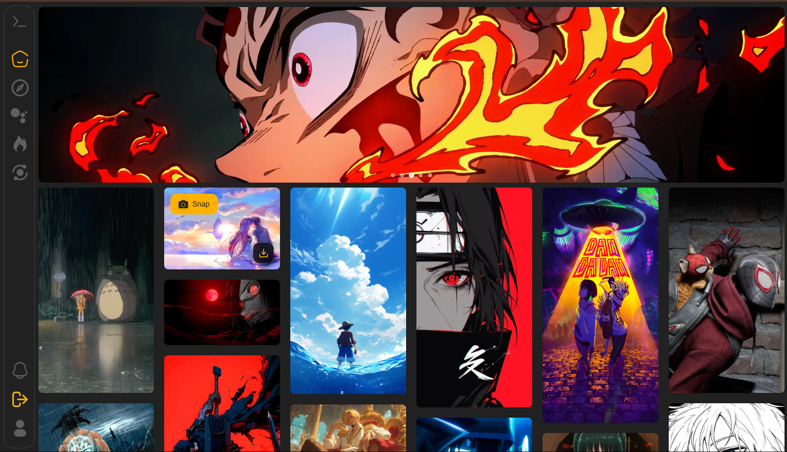

<p align="center"><em>Explore page desktop view</em></p>

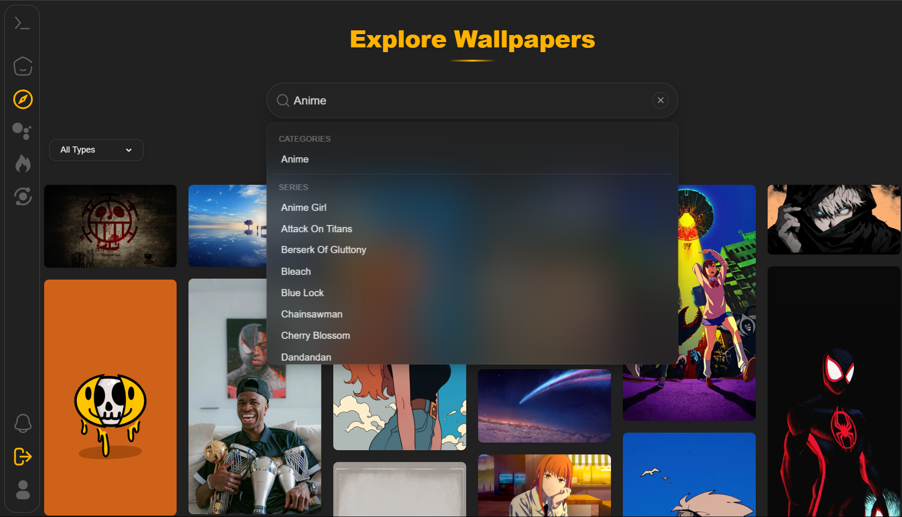

<p align="center"><em>Create page desktop view</em></p>

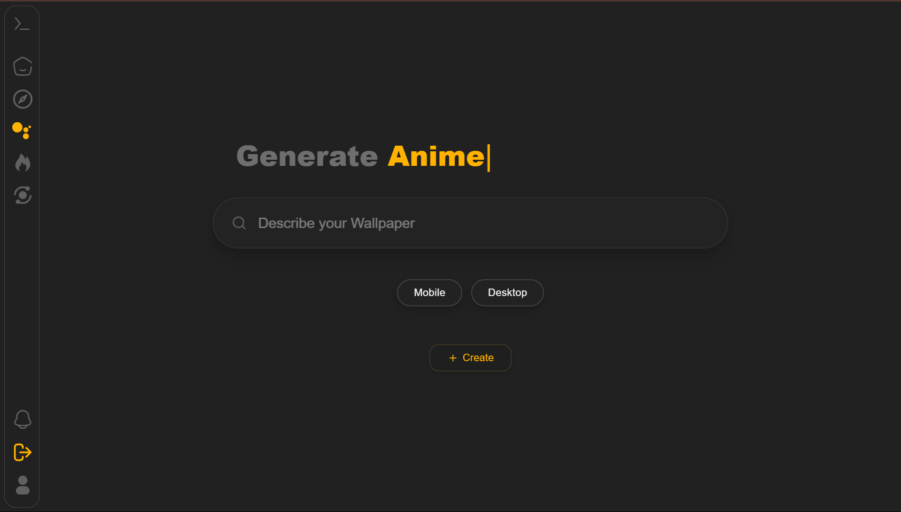

<p align="center"><em>Snap page desktop view</em></p>

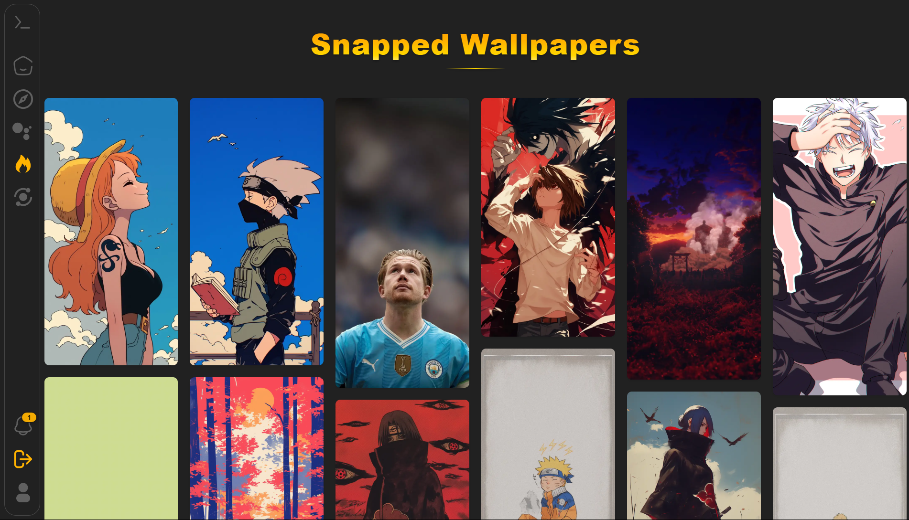

<p align="center"><em>RandomSnap page desktop view</em></p>

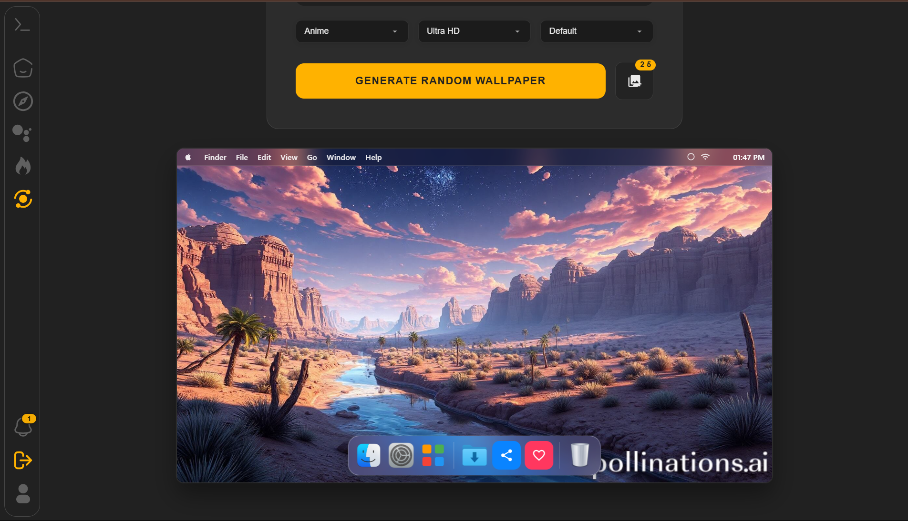

<p align="center"><em>RandomSnap page desktop view</em></p>

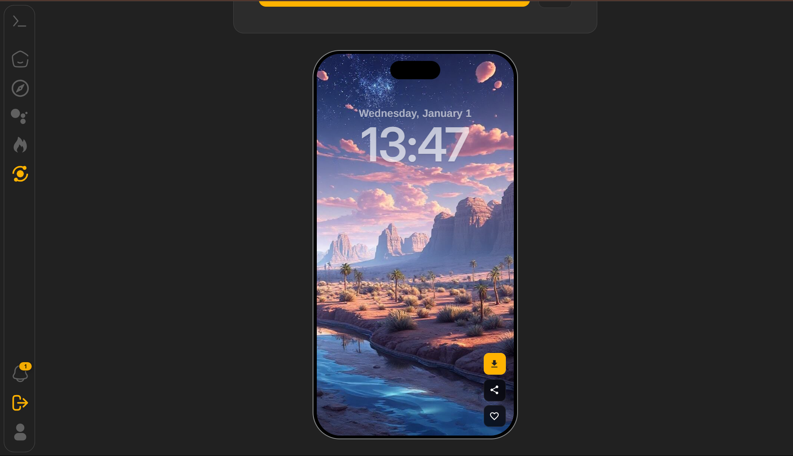

## 📱 Mobile Preview
<p align="center"><em>Home page mobile view</em></p>

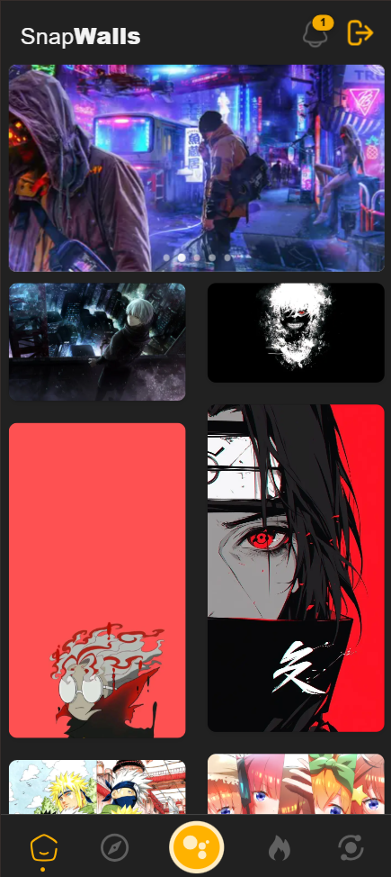

<p align="center"><em>Explore page mobile view</em></p>

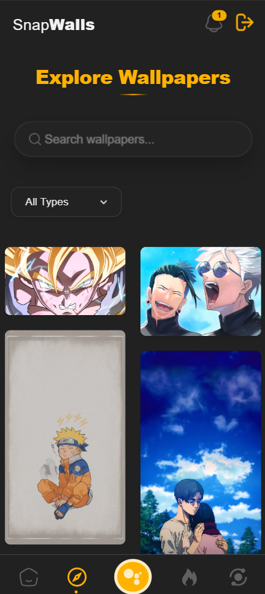

<p align="center"><em>Create page mobile view</em></p>

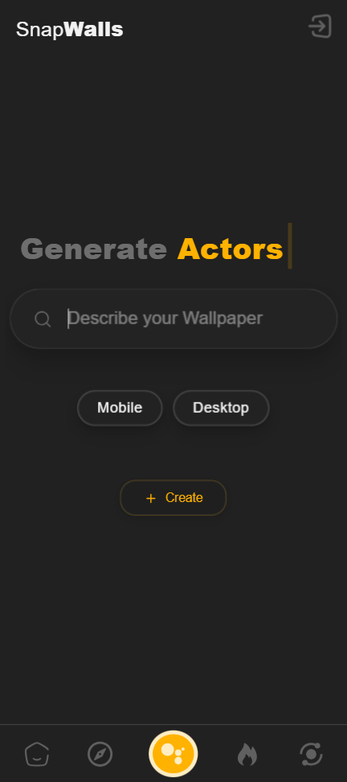

<p align="center"><em>Snap page mobile view</em></p>

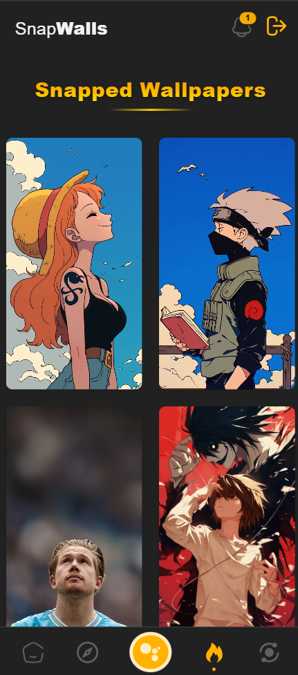


<p align="center"><em>RandomSnap page mobile view</em></p>

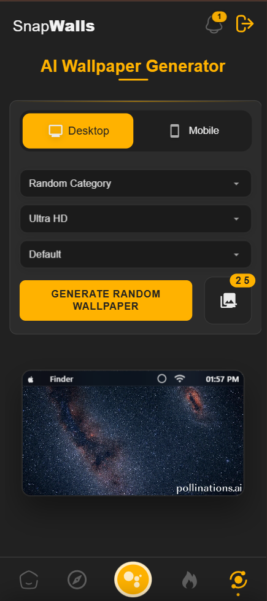

<p align="center"><em>RandomSnap page mobile view</em></p>

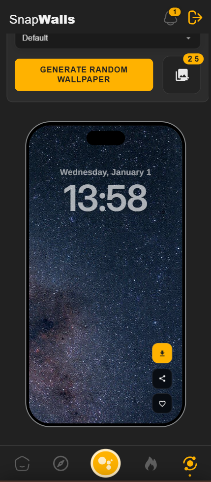

## 🌟 Features

- **AI-Powered Generation**: Create unique wallpapers using advanced AI technology
- **Dual Format Support**: Generate wallpapers for both desktop (1920x1080) and mobile (1440x2736) devices
- **Quality Presets**: Choose from Standard, Ultra HD, and Cinematic quality options
- **Style Customization**: Multiple style presets including Default, Vibrant, Moody, Dreamy, and Minimal
- **Category Selection**: Various categories including:
  - Nature
  - Abstract
  - Space
  - Cyberpunk
  - Fantasy
  - Minimal
  - Anime
- **User Features**:
  - Save favorites to your personal collection
  - View generation history
  - Download wallpapers in high resolution
  - Share wallpapers easily
- **Modern UI/UX**:
  - Responsive design for all devices
  - Interactive preview modes
  - Desktop and mobile-specific interfaces
  - Smooth animations and transitions

## 🚀 Getting Started

### Prerequisites

- Node.js (v14 or higher)
- npm or yarn
- Firebase account

### Installation

1. Clone the repository:
```bash
git clone https://github.com/adityakumar-in/Snapwalls.git
cd snapwalls
```

2. Install dependencies:
```bash
npm install
# or
yarn install
```

3. Set up environment variables:
Create a `.env.local` file in the root directory and add your Firebase configuration:
```env
NEXT_PUBLIC_FIREBASE_API_KEY=your_api_key
NEXT_PUBLIC_FIREBASE_AUTH_DOMAIN=your_auth_domain
NEXT_PUBLIC_FIREBASE_PROJECT_ID=your_project_id
NEXT_PUBLIC_FIREBASE_STORAGE_BUCKET=your_storage_bucket
NEXT_PUBLIC_FIREBASE_MESSAGING_SENDER_ID=your_sender_id
NEXT_PUBLIC_FIREBASE_APP_ID=your_app_id
```

4. Run the development server:
```bash
npm run dev
# or
yarn dev
```

5. Open [http://localhost:3000](http://localhost:3000) in your browser.

## 🛠️ Built With

- [Next.js](https://nextjs.org/) - React framework for production
- [Firebase](https://firebase.google.com/) - Backend and authentication
- [React](https://reactjs.org/) - Frontend library
- [Pollinations AI](https://pollinations.ai/) - AI image generation

## 📱 Usage

1. **Select Device Type**: Choose between desktop or mobile wallpaper format
2. **Choose Category**: Select from various categories or use random
3. **Adjust Quality**: Pick your preferred quality preset
4. **Select Style**: Choose a style preset for your wallpaper
5. **Generate**: Click the generate button to create your wallpaper
6. **Save or Share**: Download, share, or save to favorites

## 🔐 Authentication

- User authentication is handled through Firebase
- Login required for:
  - Saving favorites
  - Viewing generation history
  - Accessing personal gallery

## 🎨 Customization

The application supports various customization options:
- Quality presets for different use cases
- Style presets for artistic variation
- Category selection for targeted generation
- Device-specific optimizations

## 🤝 Contributing

Contributions are welcome! Please feel free to submit a Pull Request.

1. Fork the repository
2. Create your feature branch (`git checkout -b feature/AmazingFeature`)
3. Commit your changes (`git commit -m 'Add some AmazingFeature'`)
4. Push to the branch (`git push origin feature/AmazingFeature`)
5. Open a Pull Request

## 📄 License

This project is licensed under the MIT License - see the [LICENSE](LICENSE) file for details.

## 🙏 Acknowledgments

- Thanks to [Pollinations AI](https://pollinations.ai/) for the image generation API
- Icons and UI elements from various open-source projects
- Community contributions and feedback

## 📧 Contact

Abhishek - [@abhishekabysm](https://www.instagram.com/abhishekabysm/) | Aditya - [@coding.tutor](https://www.instagram.com/coding.tutor/)

Project Link: [https://snapwalls.vercel.app/](https://snapwalls.vercel.app/)
